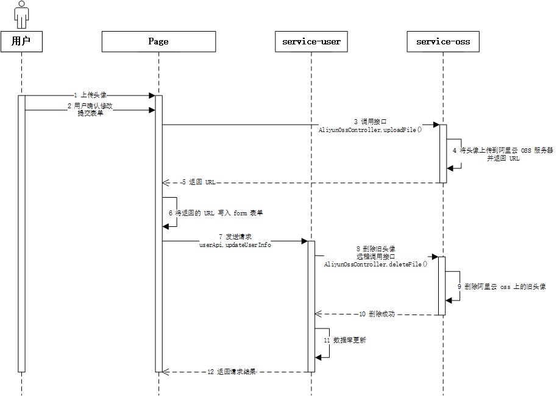
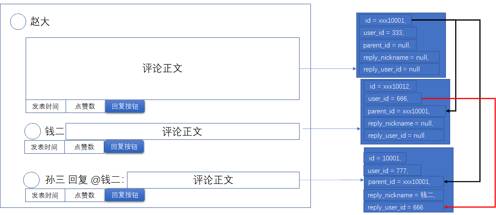

# 1	用户模块

## 1.1	功能概述

### 1.1.1	注册功能

##### ⭕使用邮箱发送验证码

<br>

##### 📌使用 SMS 发送手机验证码登录

- **前提条件**：需要开发资格认证

<br>

----

<div STYLE="page-break-after: always;">
    <br>
    <br>
    <br>
    <br>
    <br></div>


### 1.1.2	登录功能

##### ⭕使用邮箱地址配合密码登录

<br>

##### ⭕通过邮箱和验证码重新设置密码

<br>

##### ⭕退出登录

<br>

##### ⭕对需要登录才能使用的功能进行拦截

- **功能描述**：对于需要登录才能使用的功能，在访问前先检查用户 token，token 如果不存在或者过期，跳转到登录页面。

- **实现思路**：通过 gateway 实现与前端响应拦截器实现

<br>

##### ❗使用微信、腾讯以及微博扫码登录

- **前提条件**：需要开发资格认证

<br>

##### 📌使用手机号码与验证码登录

- **前提条件**：需要开发资格认证

<br>

##### 📌重复登录判断

- **实现思路**：可以使用 redis 进行判断，用户登录后在 redis 中缓存用户相关数据，使用 id 作为 key。如果登录时，key 已经存在，那么说明已经成功登录。

<br>

---

<div STYLE="page-break-after: always;">
    <br>
    <br>
    <br>
    <br>
    <br></div>
### 1.1.3	信息设置功能

##### ⭕修改基本信息<span id="1.2.3-1" style="display:none"></span>

<br>

##### ⭕修改、绑定邮箱地址

<br>

##### 📌修改、绑定手机号

<br>

##### 📌修改、绑定社交账号

<br>

##### ❗删除账号以及所有关联数据

- 实现思路

<br>

---

<div STYLE="page-break-after: always;">
    <br>
    <br>
    <br>
    <br>
    <br></div>

### 1.1.4	会员功能

##### 升级为超级会员

- 需要调用付费模块 API
- 会员有保存笔记数量上限（未开通会员上限为10）

---

<div STYLE="page-break-after: always;">
    <br>
    <br>
    <br>
    <br>
    <br></div>

### 1.1.5	笔记文件夹功能

---

<div STYLE="page-break-after: always;">
    <br>
    <br>
    <br>
    <br>
    <br></div>

### 1.1.6	收藏夹功能

----

<div STYLE="page-break-after: always;">
    <br>
    <br>
    <br>
    <br>
    <br></div>

### 1.1.6	关注功能

---

<div STYLE="page-break-after: always;">
    <br>
    <br>
    <br>
    <br>
    <br></div>

## 1.2	重要功能详细设计

### 1.2.1	头像上传

##### 问题来源

[1.2.3 用户设置 → 修改基本信息](#1.2.3-1)

<br>

##### 功能重点 —— 用户多次上传头像，或者上传头像后未保存直接退出

###### ❌方案一

1. 前端每次上传头像后，保存返回的 `imageUrl` 到数组 `imageUrls[]` 中。
2. 每次提交表单后，记录此次提交的 `imageUrl`。
3. 退出页面时，在 Vue 钩子函数 `beforeDestroy()` 中检查表单是否被提交过（通过设置 flag）。
4. 从  `imageUrls[]` 中 去除最后一次提交表单时保存的 `imageUrl`。
5. 删除 中的所有图片 。

**问题**：浏览器或页面被直接关闭时，`beforeDestroy()` 不会被调用，可以使用 `window.onbeforeunload()` ，但是实现过于复杂[^1.3.1-1]。


###### ❌方案二

1. 在提交表单时检查是否上传的图片。
2. 如果上传了图片，则先调用 `ossApi.uploadFile()` 图片上传到阿里云服务器，并将返回 URL 添加到表单中。
3. service-user 更新用户头像字段数据。
4. 如果之前设置过头像，调用 `AliyunOssClient.deleteFile()` 删除原本的头像。



**问题**：无法生成头像预览

###### ⭕方案三

1. 通过 `ossApi.uploadFileTemporary()` 上传文件到 OSS 文件的临时目录。
2. 将返回的 imageUrl 添加到表单信息
3. service-user 监测到 avatar 字段发生变化，远程调用 `AliyunOSSController.alterFileLocation()`
4. `AliyunOSSController.alterFileLocation()` 会复制上传的文件到非临时目录中。
5. **定期删除临时目录中的文件数据**。

其他：还需要判断用户是否是第一次上传头像，如果不是，需要删除旧头像

<br>

---

[^1.3.1-1]: `window.onbeforeunload()` 中只能使用原生 ajax 发送请求，数据则需要先通过 cookie 或者 localstorage 保存，才能获取。

<div STYLE="page-break-after: always;">
    <br>
    <br>
    <br>
    <br>
    <br></div>

## 1.3	数据表

##### 用户信息表（user_info）

###### 字段

| 字段名   | 字段类型         | 可为空   | 默认值 | 注释            | 索引类型    | 补充说明 |
| -------- | ---------------- | -------- | ------ | --------------- | ----------- | -------- |
| id       | varchar(32)      | NOT NULL |        | 用户id          | PRIMARY KEY |          |
| nickname | varchar(50)      |          | NULL   | 昵称            |             |          |
| sex      | tinyint unsigned |          | NULL   | 性别 0 男，1 女 |             |          |
| birthday | datetime         |          | NULL   | 年龄            |             |          |
| avatar   | varchar(255)     |          | NULL   | 用户头像        |             |          |
| sign     | varchar(100)     |          | NULL   | 用户签名        |             |          |

###### 建表属性

| 数据库引擎 | 默认数据编码 | 排序规则           | 注释       | 补充说明 |
| ---------- | ------------ | ------------------ | ---------- | -------- |
| InnoDB     | utf8mb4      | utf8mb4_0900_ai_ci | 用户信息表 |          |

###### 建表语句

```mysql
CREATE TABLE `user_info` (
  `id` varchar(32) NOT NULL COMMENT '用户id',
  `nickname` varchar(50) DEFAULT NULL COMMENT '昵称',
  `sex` tinyint unsigned DEFAULT NULL COMMENT '性别 0 男，1 女',
  `birthday` irthdaydatetime DEFAULT NULL COMMENT '年龄',
  `avatar` varchar(255) DEFAULT NULL COMMENT '用户头像',
  `sign` varchar(100) DEFAULT NULL COMMENT '用户签名',
  `is_deleted` tinyint(1) NOT NULL DEFAULT '0' COMMENT '逻辑删除 1（true）已删除， 0（false）未删除',
  `gmt_create` datetime NOT NULL COMMENT '创建时间',
  `gmt_modified` datetime NOT NULL COMMENT '更新时间',
  PRIMARY KEY (`id`)
) ENGINE=InnoDB DEFAULT CHARSET=utf8mb4 COLLATE=utf8mb4_0900_ai_ci COMMENT='用户信息表';
```

<br>

##### 用户登录验证表（user_check）  

###### 字段

| 字段名      | 字段类型     | 可为空   | 默认值 | 注释                                          | 索引类型    | 补充说明 |
| ----------- | ------------ | -------- | ------ | --------------------------------------------- | ----------- | -------- |
| id          | varchar(32)  | NOT NULL |        | 用户 id                                       | PRIMARY KEY |          |
| mobile      | varchar(11)  |          | NULL   | 手机号                                        | UNIQUE KEY  |          |
| email       | varchar(100  |          | NULL   | 邮箱地址                                      | UNIQUE KEY  |          |
| openid_wx   | varchar(128) |          | NULL   | 微信 openid                                   | UNIQUE KEY  |          |
| openid_qq   | varchar(128) |          | NULL   | QQ openid                                     | UNIQUE KEY  |          |
| openid_wb   | varchar(128) |          | NULL   | 微博 ioenid                                   | UNIQUE KEY  |          |
| password    | varchar(255) |          | NULL   | 密码                                          |             |          |
| is_disabled | tinyint(1)   | NOT NULL | 0      | 是否禁用。1（true）已禁用，0（false）未禁用。 |             |          |

###### 建表属性

| 数据库引擎 | 默认数据编码 | 排序规则           | 注释           | 补充说明 |
| ---------- | ------------ | ------------------ | -------------- | -------- |
| InnoDB     | utf8mb4      | utf8mb4_0900_ai_ci | 用户登录验证表 |          |

###### 建表语句

```mysql
CREATE TABLE `user_check` (
  `id` varchar(32) NOT NULL COMMENT '用户id',
  `mobile` varchar(11) DEFAULT NULL COMMENT '手机号',
  `email` varchar(100) DEFAULT NULL COMMENT '邮箱地址',
  `openid_wx` varchar(128) DEFAULT NULL COMMENT '微信openid',
  `openid_qq` varchar(128) DEFAULT NULL COMMENT 'QQ openid',
  `openid_wb` varchar(128) DEFAULT NULL COMMENT '微博 ioenid',
  `password` varchar(255) DEFAULT NULL COMMENT '密码',
  `is_disabled` tinyint(1) NOT NULL DEFAULT '0' COMMENT '是否禁用 1（true）已禁用，  0（false）未禁用',
  `is_deleted` tinyint(1) NOT NULL DEFAULT '0' COMMENT '逻辑删除 1（true）已删除， 0（false）未删除',
  `gmt_create` datetime NOT NULL COMMENT '创建时间',
  `gmt_modified` datetime NOT NULL COMMENT '更新时间',
  PRIMARY KEY (`id`),
  UNIQUE KEY `uk_mobile` (`mobile`),
  UNIQUE KEY `uk_email` (`email`),  
  UNIQUE KEY `uk_openid_wx` (`openid_wx`)
  UNIQUE KEY `uk_openid_qq` (`openid_qq`)
  UNIQUE KEY `uk_openid_wb` (`openid_wb`)
) ENGINE=InnoDB DEFAULT CHARSET=utf8mb4 COLLATE=utf8mb4_0900_ai_ci COMMENT='用户登录验证表';
```

<br>

##### 用户超级会员信息表（user_ultra）

###### 字段

| 字段名      | 字段类型    | 可为空   | 默认值 | 注释                               | 索引类型    | 补充说明 |
| ----------- | ----------- | -------- | ------ | ---------------------------------- | ----------- | -------- |
| id          | varchar(32) | NOT NULL |        | 用户id                             | PRIMARY KEY |          |
| is_ultra    | tinyint(1)  | NOT NULL | 0      | 是否为超级会员，1（是），0（不是） |             |          |
| gmt_expired | datetime    |          | NULL   | 超级会员到期时间                   |             |          |

###### 建表属性

| 数据库引擎 | 默认数据编码 | 排序规则           | 注释               | 补充说明 |
| ---------- | ------------ | ------------------ | ------------------ | -------- |
| `InnoDB`   | utf8mb4      | utf8mb4_0900_ai_ci | 用户超级会员信息表 |          |

###### 建表语句

```mysql
CREATE TABLE `user_member` (
  `id` varchar(32) NOT NULL COMMENT '用户id',
  `is_ultra` tinyint(1) NOT NULL DEFAULT '0' COMMENT '是否为超级会员，1（是），0（不是）',
  `gmt_expired` datetime DEFAULT NULL COMMENT '超级会员到期时间',
  `is_deleted` tinyint(1) NOT NULL DEFAULT '0' COMMENT '逻辑删除 1（true）已删除， 0（false）未删除',
  `gmt_create` datetime NOT NULL COMMENT '创建时间',
  `gmt_modified` datetime NOT NULL COMMENT '更新时间',
  PRIMARY KEY (`id`)
) ENGINE=InnoDB DEFAULT CHARSET=utf8mb4 COLLATE=utf8mb4_0900_ai_ci COMMENT='用户超级会员信息表';
```

<br>

##### 用户笔记文件夹表（user_nfolder）

###### 字段

| 字段名             | 字段类型     | 可为空   | 默认值 | 注释               | 索引类型    | 补充说明                                             |
| ------------------ | ------------ | -------- | ------ | ------------------ | ----------- | ---------------------------------------------------- |
| id                 | varchar(32)  | NOT NULL |        | 文件夹id           | PRIMARY KEY |                                                      |
| user_id            | varchar(32)  | NOT NULL |        | 用户id             | KEY         |                                                      |
| folder_name        | varchar(50)  | NOT NULL |        | 文件夹名           |             |                                                      |
| note_count         | int          | NOT NULL | 0      | 文件夹中笔记的数量 |             |                                                      |
| folder_description | varchar(100) |          | NULL   | 文件夹简介         |             |                                                      |
| is_default         | tinyint(1)   | NOT NULL | 0      | 是否为默认文件夹   |             | 注册时第一个创建的文件夹，<br>用户不可删除默认文件夹 |

###### 建表属性

| 数据库引擎 | 默认数据编码 | 排序规则           | 注释             | 补充说明 |
| ---------- | ------------ | ------------------ | ---------------- | -------- |
| InnoDB     | utf8mb4      | utf8mb4_0900_ai_ci | 用户笔记文件夹表 |          |

###### 建表语句

```mysql
CREATE TABLE `user_nfolder` (
  `id` varchar(32) NOT NULL COMMENT '文件夹id',
  `user_id` varchar(32) NOT NULL COMMENT '用户id',
  `folder_name` varchar(50) NOT NULL COMMENT '文件夹名',
  `note_count` int NOT NULL DEFAULT '0' COMMENT '文件夹中笔记的数量',
  `folder_description` varchar(100) DEFAULT NULL COMMENT '文件夹简介',
  `is_default` tinyint(1) NOT NULL DEFAULT '0' COMMENT '是否为默认文件夹',
  `is_deleted` tinyint(1) NOT NULL DEFAULT '0' COMMENT '逻辑删除 1（true）已删除， 0（false）未删除',
  `gmt_create` datetime NOT NULL COMMENT '创建时间',
  `gmt_modified` datetime NOT NULL COMMENT '更新时间',
  PRIMARY KEY (`id`),
  KEY `idx_user_id` (`user_id`)
) ENGINE=InnoDB DEFAULT CHARSET=utf8mb4 COLLATE=utf8mb4_0900_ai_ci COMMENT='用户文件夹表';
```

###### 注意

- 一个用户有多个笔记文件夹，一个笔记文件夹中有多个笔记，但是一篇笔记只属于一个文件夹。
- 默认笔记文件夹的 id 与 user_id 相同。

<br>

##### 用户收藏文件夹表（user_cfolder）

###### 字段

| 字段名             | 字段类型     | 可为空   | 默认值 | 注释               | 索引类型    | 补充说明                                             |
| ------------------ | ------------ | -------- | ------ | ------------------ | ----------- | ---------------------------------------------------- |
| id                 | varchar(32)  | NOT NULL |        | 收藏夹id           | PRIMARY KEY |                                                      |
| user_id            | varchar(32)  | NOT NULL |        | 用户id             | KEY         |                                                      |
| folder_name        | varchar(50)  | NOT NULL |        | 收藏夹名           |             |                                                      |
| note_count         | int          | NOT NULL | 0      | 收藏夹中笔记的数量 |             |                                                      |
| folder_description | varchar(100) |          | NULL   | 收藏夹简介         |             |                                                      |
| is_default         | tinyint(1)   | NOT NULL | 0      | 是否为默认收藏夹   |             | 注册时第一个创建的收藏夹，<br>用户不可删除默认收藏夹 |

###### 建表属性

| 数据库引擎 | 默认数据编码 | 排序规则           | 注释             | 补充说明 |
| ---------- | ------------ | ------------------ | ---------------- | -------- |
| InnoDB     | utf8mb4      | utf8mb4_0900_ai_ci | 用户收藏文件夹表 |          |

###### 建表语句

```mysql
CREATE TABLE `user_cfolder` (
  `id` varchar(32) NOT NULL COMMENT '文件夹id',
  `user_id` varchar(32) NOT NULL COMMENT '用户id',
  `folder_name` varchar(50) NOT NULL COMMENT '收藏夹名',
  `note_count` int NOT NULL DEFAULT '0' COMMENT '收藏夹中笔记的数量',
  `folder_description` varchar(100) DEFAULT NULL COMMENT '收藏夹简介',
  `is_default` tinyint(1) NOT NULL DEFAULT '0' COMMENT '是否为默认收藏夹',
  `is_deleted` tinyint(1) NOT NULL DEFAULT '0' COMMENT '逻辑删除 1（true）已删除， 0（false）未删除',
  `gmt_create` datetime NOT NULL COMMENT '创建时间',
  `gmt_modified` datetime NOT NULL COMMENT '更新时间',
  PRIMARY KEY (`id`),
  KEY `idx_user_id` (`user_id`)
) ENGINE=InnoDB DEFAULT CHARSET=utf8mb4 COLLATE=utf8mb4_0900_ai_ci COMMENT='用户文件夹表';
```

- 默认收藏夹的 id 与 user_id 相同。

<br>

##### 用户关注表（user_follow）

###### 字段

| 字段名        | 字段类型    | 可为空   | 默认值 | 注释           | 索引类型    | 补充说明 |
| ------------- | ----------- | -------- | ------ | -------------- | ----------- | -------- |
| id            | varchar(32) | NOT NULL |        | id             | PRIMARY KEY |          |
| user_id       | varchar(32) | NOT NULL |        | 用户id         | KEY         |          |
| follow_userId | varchar(32) | NOT NULL |        | 被关注的用户id |             |          |

###### 建表属性

| 数据库引擎 | 默认数据编码 | 排序规则           | 注释             | 补充说明 |
| ---------- | ------------ | ------------------ | ---------------- | -------- |
| InnoDB     | utf8mb4      | utf8mb4_0900_ai_ci | 用户收藏文件夹表 |          |

###### 建表语句

```mysql
CREATE TABLE `user_follow` (
  `id` varchar(32) NOT NULL COMMENT 'id',
  `user_id` varchar(32) NOT NULL COMMENT '用户 id',
  `follow_userId` varchar(32) NOT NULL COMMENT '被关注的用户 id',
  `is_deleted` tinyint(1) NOT NULL DEFAULT '0' COMMENT '逻辑删除 1（true）已删除， 0（false）未删除',
  `gmt_create` datetime NOT NULL COMMENT '创建时间',
  `gmt_modified` datetime NOT NULL COMMENT '更新时间',
  PRIMARY KEY (`id`),
  KEY `idx_user_id` (`user_id`)
) ENGINE=InnoDB DEFAULT CHARSET=utf8mb4 COLLATE=utf8mb4_0900_ai_ci COMMENT='用户关注表';
```

<br>

##### 用户动态表（user_dynamic）

###### 字段

| 字段名       | 字段类型     | 可为空   | 默认值 | 注释                                             | 索引类型    | 补充说明 |
| ------------ | ------------ | -------- | ------ | ------------------------------------------------ | ----------- | -------- |
| id           | varchar(32)  | NOT NULL |        | id                                               | PRIMARY KEY |          |
| user_id      | varchar(32)  | NOT NULL |        | 用户id                                           | KEY         |          |
| dynamic_type | tinyint      | NOT NULL |        | 动态类型（暂时包括：1-笔记公开，2-评论，3-关注） |             |          |
| dynamic_id   | varchar(32)  | NOT NULL |        | 动态对应的数据ID                                 |             |          |
| description  | varchar(100) | NOT NULL |        | 动态描述                                         |             |          |

###### 建表属性

| 数据库引擎 | 默认数据编码 | 排序规则           | 注释             | 补充说明 |
| ---------- | ------------ | ------------------ | ---------------- | -------- |
| InnoDB     | utf8mb4      | utf8mb4_0900_ai_ci | 用户收藏文件夹表 |          |

###### 建表语句

```mysql
CREATE TABLE `user_dynamic` (
  `id` varchar(32) NOT NULL COMMENT 'id',
  `user_id` varchar(32) NOT NULL COMMENT '用户 id',
  `dynamic_type` tinyint NOT NULL COMMENT '动态类型（暂时包括：1-笔记公开，2-评论，3-关注）',
  `dynamic_id` varchar(32) NOT NULL COMMENT '动态对应的数据ID',
  `description` varchar(100) NOT NULL COMMENT '动态描述',
  `is_deleted` tinyint(1) NOT NULL DEFAULT '0' COMMENT '逻辑删除 1（true）已删除， 0（false）未删除',
  `gmt_create` datetime NOT NULL COMMENT '创建时间',
  `gmt_modified` datetime NOT NULL COMMENT '更新时间',
  PRIMARY KEY (`id`),
  KEY `idx_user_id` (`user_id`)
) ENGINE=InnoDB DEFAULT CHARSET=utf8mb4 COLLATE=utf8mb4_0900_ai_ci COMMENT='用户动态表';
```

<br>

##### ❗用户数据表

<br>

---

<div STYLE="page-break-after: always;">
    <br>
    <br>
    <br>
    <br>
    <br></div>
# 2	笔记模块

## 2.1	功能概述

### 2.1.1	用户新增笔记

##### ❗新增笔记

- 使用 markdown 编辑器。

<br>

##### ❗笔记上传图片

<br>

##### ❗自动保存草稿

<br>

##### ❗设置笔记标签

<br>

##### ❗设置笔记是否公开

- 编辑时添加公开确认框，将笔记在网站首页公开，即分享功能。

<br>

##### ❗设置笔记分组

<br>

---

<div STYLE="page-break-after: always;">
    <br>
    <br>
    <br>
    <br>
    <br></div>

### 2.1.2	用户笔记管理

##### ❗删除笔记

- 将笔记设置为逻辑删除状态，并在回收站中保存 30 天。

<br>

##### ❗修改笔记内容

<br>

##### ❗修改笔记的公开状态

- 在笔记页进行修改。

<br>

##### ❗笔记回收站

- 将笔记彻底删除，或者从回收站中恢复。

<br>

##### 修改笔记的分组

- 建立文件夹，每个笔记都必须有且只有一个所属的文件夹。

<br>

---

<div STYLE="page-break-after: always;">
    <br>
    <br>
    <br>
    <br>
    <br></div>

### 2.1.3	笔记文件夹管理

##### ❗新增笔记文件夹

<br>

##### ❗修改笔记文件夹信息

<br>

##### ❗删除笔记文件夹

<br>

---

<div STYLE="page-break-after: always;">
    <br>
    <br>
    <br>
    <br>
    <br></div>

### 2.1.4	笔记公开后的相关功能

##### ❗笔记评论

<br>

##### ❗笔记点赞

<br>

##### ❗笔记收藏

<br>

##### ❗添加到收藏夹

<br>

---

<div STYLE="page-break-after: always;">
    <br>
    <br>
    <br>
    <br>
    <br></div>

## 2.2	重要功能详细设计

---

<div STYLE="page-break-after: always;">
    <br>
    <br>
    <br>
    <br>
    <br></div>

## 2.3	数据表

##### 笔记正文表（note_text）

###### 字段

| 字段名 | 字段类型    | 可为空   | 默认值 | 注释         | 索引类型    | 补充说明 |
| ------ | ----------- | -------- | ------ | ------------ | ----------- | -------- |
| id     | varchar(32) | NOT NULL |        | 笔记ID       | PRIMARY KEY |          |
| text   | text        |          |        | 笔记正文内容 |             |          |

###### 建表属性

| 数据库引擎 | 默认数据编码 | 排序规则           | 注释       | 补充说明 |
| ---------- | ------------ | ------------------ | ---------- | -------- |
| InnoDB     | utf8mb4      | utf8mb4_0900_ai_ci | 笔记正文表 |          |

###### 建表语句 

```sql
CREATE TABLE `note_text` (
  `id` varchar(32) NOT NULL COMMENT '笔记ID',
  `text` text COMMENT '笔记正文内容',
  `gmt_create` datetime NOT NULL COMMENT '创建时间',
  `gmt_modified` datetime NOT NULL COMMENT '更新时间',
  PRIMARY KEY (`id`)
) ENGINE=InnoDB DEFAULT CHARSET=utf8mb4 COLLATE=utf8mb4_0900_ai_ci COMMENT='笔记正文表';
```

<br>

##### 笔记信息表（note_info）

###### 字段

| 字段名           | 字段类型        | 可为空   | 默认值 | 注释                               | 索引类型    | 补充说明                                           |
| ---------------- | --------------- | -------- | ------ | ---------------------------------- | ----------- | -------------------------------------------------- |
| id               | varchar(32)     | NOT NULL |        | 笔记ID                             | PRIMARY KEY |                                                    |
| user_id          | varchar(32)     | NOT NULL |        | 用户ID（发布者ID）                 | KEY         |                                                    |
| note_folder_id   | varchar(32)     | NOT NULL |        | 文件夹ID                           | KEY         |                                                    |
| title            | varchar(50)     |          | NULL   | 笔记标题                           | KEY         |                                                    |
| preview          | varchar(150)    |          | NULL   | 笔记预览                           |             | 如果预览的长度超过60字，则在末尾手动添加符号 `…`。 |
| cover            | varchar(255)    | NOT NULL | NULL   | 笔记封面                           |             |                                                    |
| length           | int unsigned    | NOT NULL | 0      | 笔记长度                           |             |                                                    |
| likes            | bigint unsigned | NOT NULL | 0      | 点赞数                             |             |                                                    |
| collection_count | bigint unsigned | NOT NULL | 0      | 收藏数                             |             |                                                    |
| comment_count    | bigint unsigned | NOT NULL | 0      | 评论数                             |             |                                                    |
| status           | tinyint(1)      | NOT NULL | 0      | 0 草稿状态，1 完成状态，2 发布状态 |             |                                                    |
| version          | bigint unsigned | NOT NULL | 1      | 乐观锁                             |             |                                                    |

###### 建表属性

| 数据库引擎 | 默认数据编码 | 排序规则           | 注释       | 补充说明 |
| ---------- | ------------ | ------------------ | ---------- | -------- |
| InnoDB     | utf8mb4      | utf8mb4_0900_ai_ci | 笔记信息表 |          |

###### 建表语句

```sql
CREATE TABLE `note_info` (
  `id` varchar(32) NOT NULL COMMENT '笔记ID',
  `user_id` varchar(32) NOT NULL COMMENT '用户ID（发布者ID）',
  `note_folder_id` varchar(32) NOT NULL COMMENT '文件夹ID',
  `title` varchar(50) DEFAULT NULL COMMENT '笔记标题',
  `preview` varchar(150) DEFAULT NULL COMMENT '笔记预览',
  `cover` varchar(255) DEFAULT NULL COMMENT '笔记封面',
  `length` int unsigned NOT NULL DEFAULT '0' COMMENT '笔记长度',
  `likes` bigint unsigned NOT NULL DEFAULT '0' COMMENT '点赞数',
  `collection_count` bigint unsigned NOT NULL DEFAULT '0' COMMENT '收藏数',
  `comment_count` bigint unsigned NOT NULL DEFAULT '0' COMMENT '评论数',
  `status` tinyint(1) NOT NULL DEFAULT '0' COMMENT '发布状态 1（true）发布， 0（false）未发布',
  `version` bigint unsigned NOT NULL DEFAULT '1' COMMENT '乐观锁',
  `is_deleted` tinyint(1) NOT NULL DEFAULT '0' COMMENT '逻辑删除 1（true）已删除， 0（false）未删除',
  `gmt_create` datetime NOT NULL COMMENT '创建时间',
  `gmt_modified` datetime NOT NULL COMMENT '更新时间',
  PRIMARY KEY (`id`),
  KEY `idx_title` (`title`),
  KEY `idx_user_id` (`user_id`),
  KEY `idx_note_folder_id` (`note_folder_id`)
) ENGINE=InnoDB DEFAULT CHARSET=utf8mb4 COLLATE=utf8mb4_0900_ai_ci COMMENT='笔记信息表';
```

<br>

##### 笔记—用户—收藏夹关系表（note_user_collection）

###### 字段

| 字段名               | 字段类型    | 可为空   | 默认值 | 注释     | 索引类型    | 补充说明 |
| -------------------- | ----------- | -------- | ------ | -------- | ----------- | -------- |
| id                   | varchar(32) | NOT NULL |        | ID       | PRIMARY KEY |          |
| note_id              | varchar(32) | NOT NULL |        | 笔记ID   | KEY         |          |
| user_id              | varchar(32) | NOT NULL |        | 用户ID   | KEY         |          |
| collection_folder_id | varchar(32) | NOT NULL |        | 收藏夹ID | KEY         |          |

###### 建表属性

| 数据库引擎 | 默认数据编码 | 排序规则           | 注释              | 补充说明 |
| ---------- | ------------ | ------------------ | ----------------- | -------- |
| InnoDB     | utf8mb4      | utf8mb4_0900_ai_ci | 笔记—收藏夹关系表 |          |

###### 建表语句

```sql
CREATE TABLE `note_user_collection` (
  `id` varchar(32) NOT NULL COMMENT 'ID',
  `note_id` varchar(32) NOT NULL COMMENT '笔记ID',
  `user_id` varchar(32) NOT NULL COMMENT '用户ID',
  `collection_folder_id` varchar(32) NOT NULL COMMENT '收藏夹ID',
  `is_deleted` tinyint(1) NOT NULL DEFAULT '0' COMMENT '逻辑删除 1（true）已删除， 0（false）未删除',
  `gmt_create` datetime NOT NULL COMMENT '创建时间',
  `gmt_modified` datetime NOT NULL COMMENT '更新时间',
  PRIMARY KEY (`id`),
  KEY `idx_note_id` (`note_id`),
  KEY `idx_collection_folder_id` (`collection_folder_id`),
  KEY `idx_user_id` (`user_id`)
) ENGINE=InnoDB DEFAULT CHARSET=utf8mb3 COMMENT='笔记—用户-收藏夹关系表';
```

<br>

##### 笔记评论表（note_comment）

###### 字段

| 字段名           | 字段类型        | 可为空   | 默认值 | 注释                   | 索引类型    | 补充说明 |
| ---------------- | --------------- | -------- | ------ | ---------------------- | ----------- | -------- |
| id               | varchar(32)     | NOT NULL |        | 评论ID                 | PRIMARY KEY |          |
| note_id          | varchar(32)     | NOT NULL |        | 笔记ID                 | KEY         |          |
| user_id          | varchar(32)     | NOT NULL |        | 用户ID（评论发布者ID） | KEY         |          |
| nickname         | varchar(50)     | NOT NULL |        | 用户昵称               |             |          |
| avatar           | varchar(255)    | NOT NULL |        | 用户头像               |             |          |
| content          | varchar(500)    | NOT NULL |        | 评论内容               |             |          |
| likes            | bigint unsigned | NOT NULL | 0      | 点赞数                 |             |          |
| reply_count      | bigint unsigned | NOT NULL | 0      | 回复数                 |             |          |
| reply_comment_id | varchar(32)     |          | NULL   | 所属评论ID             |             |          |
| reply_nickname   | varchar(50)     |          | NULL   | 被回复人昵称           |             |          |
| reply_user_id    | varchar(32)     |          | NULL   | 被回复人ID             |             |          |

###### 建表属性

| 数据库引擎 | 默认数据编码 | 排序规则           | 注释       | 补充说明 |
| ---------- | ------------ | ------------------ | ---------- | -------- |
| InnoDB     | utf8mb4      | utf8mb4_0900_ai_ci | 笔记评论表 |          |

###### 建表语句

```sql
CREATE TABLE `note_comment` (
  `id` varchar(32) CHARACTER SET utf8mb4 COLLATE utf8mb4_0900_ai_ci NOT NULL DEFAULT '' COMMENT '评论ID',
  `note_id` varchar(32) NOT NULL DEFAULT '' COMMENT '笔记id',
  `user_id` varchar(32) NOT NULL COMMENT '用户ID（评论发布者ID）',
  `nickname` varchar(50) NOT NULL COMMENT '用户昵称',
  `avatar` varchar(255) NOT NULL COMMENT '用户头像',
  `content` varchar(500) NOT NULL COMMENT '评论内容',
  `likes` bigint unsigned NOT NULL DEFAULT '0' COMMENT '点赞数',
  `reply_count` bigint unsigned NOT NULL DEFAULT '0' COMMENT '回复数',
  `reply_comment_id` varchar(32) DEFAULT NULL COMMENT '所属评论 ID',
  `reply_nickname` varchar(50) DEFAULT NULL COMMENT '被回复人昵称',
  `reply_user_id` varchar(32) DEFAULT NULL COMMENT '用户ID（评论发布者ID）',
  `is_deleted` tinyint unsigned NOT NULL DEFAULT '0' COMMENT '逻辑删除 1（true）已删除， 0（false）未删除',
  `gmt_create` datetime NOT NULL COMMENT '创建时间',
  `gmt_modified` datetime NOT NULL COMMENT '更新时间',
  PRIMARY KEY (`id`),
  KEY `idx_user_id` (`user_id`)
) ENGINE=InnoDB DEFAULT CHARSET=utf8mb4 COLLATE=utf8mb4_0900_ai_ci COMMENT='笔记评论表';
```

###### 注意

`被回复人昵称 `、 `被回复人ID` 与 `所属评论ID` 分属于两个不同的评论，类似下图：



<br>

##### ❗笔记标签表

```

```

<br>

---

<div STYLE="page-break-after: always;">
    <br>
    <br>
    <br>
    <br>
    <br></div>

# 3	付费模块

## 3.3	数据表

##### 开通会员订单表（transaction_member_order）

###### 字段

| 字段名      | 字段类型      | 可为空   | 默认值 | 注释                            | 索引类型    | 补充说明 |
| ----------- | ------------- | -------- | ------ | ------------------------------- | ----------- | -------- |
| id          | varchar(32)   | NOT NULL |        | ID                              | PRIMARY KEY |          |
| order_no    | varchar(20)   | NOT NULL |        | 订单号，由外部支付接口返回      | UNIQUE KEY  |          |
| user_id     | varchar(32)   | NOT NULL |        |                                 |             |          |
| description | varchar(100)  | NOT NULL |        | 商品描述                        |             |          |
| total_fee   | decimal(10,2) | NOT NULL | 0.01   | 订单金额（单位：分）            |             |          |
| pay_type    | tinyint       | NOT NULL |        | 支付类型（1：微信 2：支付宝）   |             |          |
| status      | tinyint       |          | 0      | 订单状态（0：未支付 1：已支付） |             |          |

###### 建表属性

| 数据库引擎 | 默认数据编码 | 排序规则           | 注释           | 补充说明 |
| ---------- | ------------ | ------------------ | -------------- | -------- |
| InnoDB     | utf8mb4      | utf8mb4_0900_ai_ci | 超级会员订单表 |          |

###### 建表语句

```sql
CREATE TABLE `transaction_member` (
  `id` varchar(32) NOT NULL DEFAULT 'ID',
  `order_no` varchar(20) NOT NULL COMMENT '订单号',
  `user_id` varchar(32) NOT NULL COMMENT '用户id',
  `description` varchar(100) NOT NULL COMMENT '商品描述',
  `total_fee` decimal(10,2) NOT NULL DEFAULT '0.01' COMMENT '订单金额（分）',
  `pay_type` tinyint NOT NULL COMMENT '支付类型（1：微信 2：支付宝）',
  `status` tinyint NOT NULL DEFAULT '0' COMMENT '订单状态（0：未支付 1：已支付）',
  
  `is_deleted` tinyint unsigned NOT NULL DEFAULT '0' COMMENT '逻辑删除 1（true）已删除， 0（false）未删除',
  `gmt_create` datetime NOT NULL COMMENT '创建时间',
  `gmt_modified` datetime NOT NULL COMMENT '更新时间',
  
  PRIMARY KEY (`id`),
  UNIQUE KEY `ux_order_no` (`order_no`)
) ENGINE=InnoDB DEFAULT CHARSET=utf8mb4 COLLATE=utf8mb4_0900_ai_ci COMMENT='会员订单表';
```

<br>

##### 开通会员支付日志表（transaction_member_log）

###### 字段

| 字段名         | 字段类型      | 可为空   | 默认值 | 注释                          | 索引类型 | 补充说明 |
| -------------- | ------------- | -------- | ------ | ----------------------------- | -------- | -------- |
| id             | varchar(32)   | NOT NULL |        | ID                            |          |          |
| order_no       | varchar(20)   | NOT NULL |        | 订单号                        |          |          |
| pay_time       | datetime      |          | NULL   | 支付完成时间                  |          |          |
| total_fee      | decimal(10,2) |          | 0.01   | 支付金额（分）                |          |          |
| transaction_id | varchar(30)   |          | NULL   | 交易流水号                    |          |          |
| trade_state    | char(20)      |          | NULL   | 交易状态                      |          |          |
| pay_type       | tinyint       | NOT NULL |        | 支付类型（1：微信 2：支付宝） |          |          |
| attr           | text          |          |        | 其他属性                      |          |          |

###### 建表属性

| 数据库引擎 | 默认数据编码 | 排序规则           | 注释               | 补充说明 |
| ---------- | ------------ | ------------------ | ------------------ | -------- |
| InnoDB     | utf8mb4      | utf8mb4_0900_ai_ci | 超级会员支付日志表 |          |

###### 建表语句

```
CREATE TABLE `transaction_member_log` (
  `id` varchar(32) NOT NULL DEFAULT 'ID',
  `order_no` varchar(20) NOT NULL COMMENT '订单号',
  `pay_time` datetime DEFAULT NULL COMMENT '支付完成时间',
  `total_fee` decimal(10,2) NOT NULL DEFAULT '0.01' COMMENT '支付金额（分）',
  `transaction_id` varchar(30) DEFAULT NULL COMMENT '交易流水号',
  `trade_state` char(20) DEFAULT NULL COMMENT '交易状态',
  `pay_type` tinyint NOT NULL COMMENT '支付类型（1：微信 2：支付宝）',
  `attr` text COMMENT '其他属性',
  
  `gmt_create` datetime NOT NULL COMMENT '创建时间',
  `gmt_modified` datetime NOT NULL COMMENT '更新时间',
  PRIMARY KEY (`id`)
) ENGINE=InnoDB DEFAULT CHARSET=utf8mb4 COLLATE=utf8mb4_0900_ai_ci COMMENT='会员支付日志表';
```

<br>

---

<div STYLE="page-break-after: always;">
    <br>
    <br>
    <br>
    <br>
    <br></div>

# 4	前台模块

### 4.1	功能实现

##### 根据关键字搜索被发布的笔记

- 使用 ElasticSearch 进行搜索

<br>

----

<div STYLE="page-break-after: always;">
    <br>
    <br>
    <br>
    <br>
    <br></div>

# 5	OSS 模块

## 5.1	功能实现

- 使用阿里云对象存储

<br>

---

<div STYLE="page-break-after: always;">
    <br>
    <br>
    <br>
    <br>
    <br></div>
## 5.3	表设计

##### 阿里云 oss 资源管理表（aliyun_oss_resource）

###### 字段

| 字段名    | 字段类型     | 可为空   | 默认值 | 注释                                                         | 索引类型    | 补充说明 |
| --------- | ------------ | -------- | ------ | ------------------------------------------------------------ | ----------- | -------- |
| id        | varchar(32)  | NOT NULL |        | ID                                                           | PRIMARY KEY |          |
| type      | tinyint      |          | NULL   | 资源类型（0：用户头像，1：笔记图片，2：笔记封面，3：待定，4：待定，5：待定） | KEY         |          |
| belong_id | varchar(32)  |          | NULL   | 该资源的使用者ID（使用者可能为用户，也可能为笔记，或者其他） | KEY         |          |
| src       | varchar(255) | NOT NULL |        | 资源url地址                                                  |             |          |
| in_use    | tinyint(1)   | NOT NULL | 0      | 是否在使用中：1（true）在使用中， 0（false）不在使用中       | KEY         |          |
| deleted   | tinyint(1)   | NOT NULL | 0      | 该字段与 is _deleted 字段不同，表示资源是否已经删除： 1（true）已删除， 0（false）未删除 |             |          |

###### 建表属性

| 数据库引擎 | 默认数据编码 | 排序规则           | 注释                  | 补充说明 |
| ---------- | ------------ | ------------------ | --------------------- | -------- |
| InnoDB     | utf8mb4      | utf8mb4_0900_ai_ci | 阿里云 oss 资源管理表 |          |

###### 建表语句

```sql
CREATE TABLE `aliyun_oss_resource` (
  `id` varchar(32) NOT NULL COMMENT 'ID',
  `type` tinyint DEFAULT NULL COMMENT '资源类型（0：用户头像，1：笔记图片，2：笔记封面，3：待定，4：待定，5：待定）',
  `belong_id` varchar(32) DEFAULT NULL COMMENT '该资源的使用者ID（使用者可能为用户，也可能为笔记，或者其他）',
  `src` varchar(255) NOT NULL COMMENT '资源url地址',
  `in_use` tinyint(1) NOT NULL DEFAULT '0' COMMENT '是否在使用中：1（true）在使用中， 0（false）不在使用中',
  `deleted` tinyint(1) NOT NULL DEFAULT '0' COMMENT '资源是否已经删除： 1（true）已删除， 0（false）未删除',
    
  `gmt_create` datetime NOT NULL COMMENT '创建时间',
  `gmt_modified` datetime NOT NULL COMMENT '更新时间',
  PRIMARY KEY (`id`),
  KEY `idx_type` (`type`),
  KEY `idx_belong_id` (`belong_id`),
  KEY `idx_in_use` (`in_use`)
) ENGINE=InnoDB DEFAULT CHARSET=utf8mb4 COLLATE=utf8mb4_0900_ai_ci COMMENT='阿里云 oss 资源管理表';
```

<br>

---

<div STYLE="page-break-after: always;">
    <br>
    <br>
    <br>
    <br>
    <br></div>

# 6	SMS 模块

---

<div STYLE="page-break-after: always;">
    <br>
    <br>
    <br>
    <br>
    <br></div>

# 7	站内消息模块

---

<div STYLE="page-break-after: always;">
    <br>
    <br>
    <br>
    <br>
    <br></div>

# 8	数据同步模块

---

<div STYLE="page-break-after: always;">
    <br>
    <br>
    <br>
    <br>
    <br></div>
# 附录

##### 表设计模板


````
##### 表（）

###### 字段

| 字段名 | 字段类型 | 可为空 | 默认值 | 注释 | 索引类型 | 补充说明 |
| ------ | -------- | ------ | ------ | ---- | -------- | -------- |
|        |          |        |        |      |          |          |

###### 建表属性

| 数据库引擎 | 默认数据编码 | 排序规则           | 注释 | 补充说明 |
| ---------- | ------------ | ------------------ | ---- | -------- |
| InnoDB     | utf8mb4      | utf8mb4_0900_ai_ci |      |          |

###### 建表语句

```
CREATE TABLE `` (
  `id` varchar(32) NOT NULL COMMENT 'ID',
  `is_deleted` tinyint unsigned NOT NULL DEFAULT '0' COMMENT '逻辑删除 1（true）已删除， 0（false）未删除',
  `gmt_create` datetime NOT NULL COMMENT '创建时间',
  `gmt_modified` datetime NOT NULL COMMENT '更新时间',
  PRIMARY KEY (`id`),
) ENGINE=InnoDB DEFAULT CHARSET=utf8mb4 COLLATE=utf8mb4_0900_ai_ci COMMENT='';
```
````

##### 符号说明

- ⭕：已经完成的 <u>功能</u> 或 <u>实现方案</u>
- ❗：计划最近要实现的功能
- 📌：由于技术原因暂时无法实现，但是计划之后要实现的功能
- ❌：放弃实现的 <u>功能</u> 或 <u>实现方案</u>

