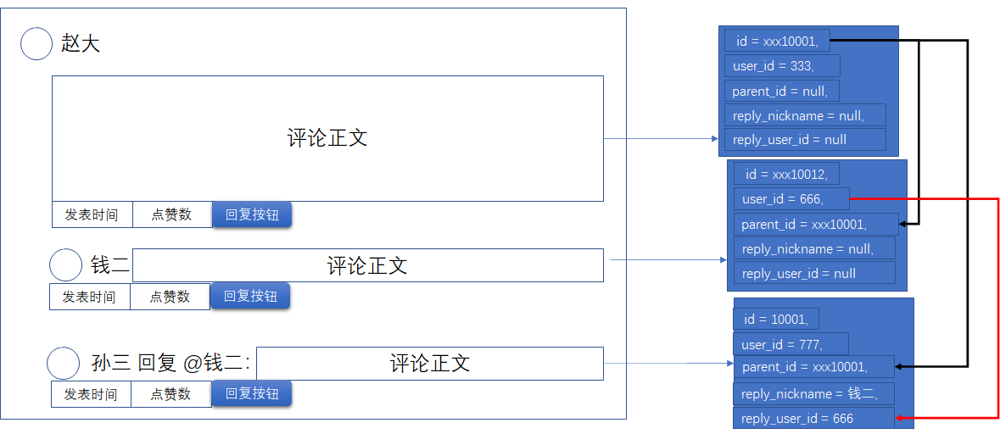

# 1	需求分析

## 1.1	功能性需求

##### 注册功能

- 允许用户通过邮箱或手机号进行注册
- 设置密码与确认
- Captcha 验证

<br>

##### 登录功能

- 使用邮箱或手机号进行登录
- 使用手机号与短信验证码进行登录
- 记住我功能
- 账号找回
- Captcha 验证

<br>

##### 用户个人信息

- 设置用户名（可重复）
- 设置头像
- 修改密码

<br>

##### 笔记

- 使用 MarkDown 语法进行笔记
- 可以插入图片

<br>

##### 笔记管理

- 笔记搜索
- 笔记批量选择
- 笔记删除
- 笔记排序（按时间排序、按标题排序）
- 笔记分组
- 笔记修改
- 笔记回收站

<br>

##### 定时任务提醒

- 发送邮件或短信进行提醒。
- 仅支持文字内容。
- 与笔记属于并列关系

<br>

##### 后台管理

- 数据分析
- 权限管理
- 用户管理
- 笔记管理

<br>

---

<div STYLE="page-break-after: always;">
    <br>
    <br>
    <br>
    <br>
    <br></div>

## 1.2	非功能性需求

##### 性能需求

<br>

##### 环境需求

- 支持主流网页浏览（不支持旧版本 IE 浏览器）
- 支持手机浏览器

<br>

##### 安全需求

<br>

##### 页面设计需求

- 功能简洁易懂

<br>

---

<div STYLE="page-break-after: always;">
    <br>
    <br>
    <br>
    <br>
    <br></div>
# 2	技术选型

##### JDK 版本

jdk 11


##### 服务器

- Linux version 3.10.0-514.26.2.el7.x86_64 (builder@kbuilder.dev.centos.org) (gcc version 4.8.5 20150623 (Red Hat 4.8.5-11) (GCC) ) #1 SMP Tue Jul 4 15:04:05 UTC 2017

<br>

##### 关系型数据库

- Ver 8.0.26 for Linux on x86_64  (MySQL Community Server - GPL)

<br>

##### JDK

- JDK 17

<br>

##### 数据缓存

###### 本地缓存

- Nginx
- OpenResty
- Redis

###### 进程缓存

- Caffeine

###### 缓存同步

- Canal

<br>

##### 搜索引擎

- Elastic Search

<br>

##### 后端技术

- Spring
- Spring MVC
- Spring Boot
- MyBatis
- MyBatis Plus

<br>

##### 微服务框架

- Spring Cloud Alibaba

<br>

##### 消息中间件

- RabbitMQ

<br>

##### 前端框架

- Vue.js + ElementUI

<br>

##### 📌分布式代码生成器

- 待定

<br>

---

<div STYLE="page-break-after: always;">
    <br>
    <br>
    <br>
    <br>
    <br></div>

# 3	模块划分与实现【⭐】

## 3.1	用户模块

### 3.1.1	功能

##### 用户注册功能

- 使用邮箱发送验证码
- 【❗待完成】使用 SMS 发送验证码登录

<br>

##### 用户登录功能

- 使用邮箱地址配合密码登录
- 使用手机号码与验证码登录
- 使用微信或腾讯扫码登录

<br>

##### 用户个人主页

- 修改头像
- 设置或修改邮箱地址
- 设置或修改手机号码
- 修改性别与年龄
- 修改用户签名

<br>

##### 用户会员功能

- 升级为超级会员：
  - 需要调用付费模块 API
  - 会员有保存笔记数量上限（未开通会员上限为10）

<br>

---

<div STYLE="page-break-after: always;">
    <br>
    <br>
    <br>
    <br>
    <br></div>

### 3.1.2	数据表

##### 用户信息表（user_info）

###### 字段

| 字段名   | 字段类型         | 可为空   | 默认值 | 注释            | 索引类型    | 补充说明 |
| -------- | ---------------- | -------- | ------ | --------------- | ----------- | -------- |
| id       | varchar(32)      | NOT NULL |        | 用户id          | PRIMARY KEY |          |
| nickname | varchar(50)      |          | NULL   | 昵称            |             |          |
| sex      | tinyint unsigned |          | NULL   | 性别 0 男，1 女 |             |          |
| age      | tinyint unsigned |          | NULL   | 年龄            |             |          |
| avatar   | varchar(255)     |          | NULL   | 用户头像        |             |          |
| sign     | varchar(100)     |          | NULL   | 用户签名        |             |          |

###### 建表属性

| 数据库引擎 | 默认数据编码 | 排序规则           | 注释       | 补充说明 |
| ---------- | ------------ | ------------------ | ---------- | -------- |
| InnoDB     | utf8mb4      | utf8mb4_0900_ai_ci | 用户信息表 |          |

###### 建表语句

```mysql
CREATE TABLE `user_info` (
  `id` varchar(32) NOT NULL COMMENT '用户id',
  `nickname` varchar(50) DEFAULT NULL COMMENT '昵称',
  `sex` tinyint unsigned DEFAULT NULL COMMENT '性别 0 男，1 女',
  `age` tinyint unsigned DEFAULT NULL COMMENT '年龄',
  `avatar` varchar(255) DEFAULT NULL COMMENT '用户头像',
  `sign` varchar(100) DEFAULT NULL COMMENT '用户签名',
  `is_deleted` tinyint(1) NOT NULL DEFAULT '0' COMMENT '逻辑删除 1（true）已删除， 0（false）未删除',
  `gmt_create` datetime NOT NULL COMMENT '创建时间',
  `gmt_modified` datetime NOT NULL COMMENT '更新时间',
  PRIMARY KEY (`id`)
) ENGINE=InnoDB DEFAULT CHARSET=utf8mb4 COLLATE=utf8mb4_0900_ai_ci COMMENT='用户信息表';
```

<br>

##### 用户登录验证表（user_check）  

###### 字段

| 字段名      | 字段类型     | 可为空   | 默认值 | 注释                                          | 索引类型    | 补充说明 |
| ----------- | ------------ | -------- | ------ | --------------------------------------------- | ----------- | -------- |
| id          | varchar(32)  | NOT NULL |        | 用户id                                        | PRIMARY KEY |          |
| mobile      | varchar(11)  |          | NULL   | 手机号                                        | UNIQUE KEY  |          |
| email       | varchar(100  |          | NULL   | 邮箱地址                                      | UNIQUE KEY  |          |
| openid_wx   | varchar(128) |          | NULL   | 微信openid                                    | UNIQUE KEY  |          |
| password    | varchar(255) |          | NULL   | 密码                                          |             |          |
| is_disabled | tinyint(1)   | NOT NULL | 0      | 是否禁用。1（true）已禁用，0（false）未禁用。 |             |          |

###### 建表属性

| 数据库引擎 | 默认数据编码 | 排序规则           | 注释           | 补充说明 |
| ---------- | ------------ | ------------------ | -------------- | -------- |
| InnoDB     | utf8mb4      | utf8mb4_0900_ai_ci | 用户登录验证表 |          |

###### 建表语句

```mysql
CREATE TABLE `user_check` (
  `id` varchar(32) NOT NULL COMMENT '用户id',
  `mobile` varchar(11) DEFAULT NULL COMMENT '手机号',
  `email` varchar(100) DEFAULT NULL COMMENT '邮箱地址',
  `openid_wx` varchar(128) DEFAULT NULL COMMENT '微信openid',
  `password` varchar(255) DEFAULT NULL COMMENT '密码',
  `is_disabled` tinyint(1) NOT NULL DEFAULT '0' COMMENT '是否禁用 1（true）已禁用，  0（false）未禁用',
  `is_deleted` tinyint(1) NOT NULL DEFAULT '0' COMMENT '逻辑删除 1（true）已删除， 0（false）未删除',
  `gmt_create` datetime NOT NULL COMMENT '创建时间',
  `gmt_modified` datetime NOT NULL COMMENT '更新时间',
  PRIMARY KEY (`id`),
  UNIQUE KEY `uk_mobile` (`mobile`),
  UNIQUE KEY `uk_email` (`email`),  
  UNIQUE KEY `uk_openid_wx` (`openid_wx`)
) ENGINE=InnoDB DEFAULT CHARSET=utf8mb4 COLLATE=utf8mb4_0900_ai_ci COMMENT='用户登录验证表';
```

<br>

##### 用户超级会员信息表（user_ultra）

###### 字段

| 字段名      | 字段类型    | 可为空   | 默认值 | 注释                               | 索引类型    | 补充说明 |
| ----------- | ----------- | -------- | ------ | ---------------------------------- | ----------- | -------- |
| id          | varchar(32) | NOT NULL |        | 用户id                             | PRIMARY KEY |          |
| is_ultra    | tinyint(1)  | NOT NULL | 0      | 是否为超级会员，1（是），0（不是） |             |          |
| gmt_expired | datetime    |          | NULL   | 超级会员到期时间                   |             |          |

###### 建表属性

| 数据库引擎 | 默认数据编码 | 排序规则           | 注释               | 补充说明 |
| ---------- | ------------ | ------------------ | ------------------ | -------- |
| `InnoDB`   | utf8mb4      | utf8mb4_0900_ai_ci | 用户超级会员信息表 |          |

###### 建表语句

```mysql
CREATE TABLE `user_ultra` (
  `id` varchar(32) NOT NULL COMMENT '用户id',
  `is_ultra` tinyint(1) NOT NULL DEFAULT '0' COMMENT '是否为超级会员，1（是），0（不是）',
  `gmt_expired` datetime DEFAULT NULL COMMENT '超级会员到期时间',
  `is_deleted` tinyint(1) NOT NULL DEFAULT '0' COMMENT '逻辑删除 1（true）已删除， 0（false）未删除',
  `gmt_create` datetime NOT NULL COMMENT '创建时间',
  `gmt_modified` datetime NOT NULL COMMENT '更新时间',
  PRIMARY KEY (`id`)
) ENGINE=InnoDB DEFAULT CHARSET=utf8mb4 COLLATE=utf8mb4_0900_ai_ci COMMENT='用户超级会员信息表';
```

<br>

##### 用户笔记文件夹表（user_nfolder）

###### 字段

| 字段名             | 字段类型     | 可为空   | 默认值 | 注释               | 索引类型    | 补充说明                                             |
| ------------------ | ------------ | -------- | ------ | ------------------ | ----------- | ---------------------------------------------------- |
| id                 | varchar(32)  | NOT NULL |        | 文件夹id           | PRIMARY KEY |                                                      |
| user_id            | varchar(32)  | NOT NULL |        | 用户id             | KEY         |                                                      |
| folder_name        | varchar(50)  | NOT NULL |        | 文件夹名           |             |                                                      |
| note_count         | int          | NOT NULL | 0      | 文件夹中笔记的数量 |             |                                                      |
| folder_description | varchar(100) |          | NULL   | 文件夹简介         |             |                                                      |
| is_default         | tinyint(1)   | NOT NULL | 0      | 是否为默认文件夹   |             | 注册时第一个创建的文件夹，<br>用户不可删除默认文件夹 |

###### 建表属性

| 数据库引擎 | 默认数据编码 | 排序规则           | 注释             | 补充说明 |
| ---------- | ------------ | ------------------ | ---------------- | -------- |
| InnoDB     | utf8mb4      | utf8mb4_0900_ai_ci | 用户笔记文件夹表 |          |

###### 建表语句

```mysql
CREATE TABLE `user_nfolder` (
  `id` varchar(32) NOT NULL COMMENT '文件夹id',
  `user_id` varchar(32) NOT NULL COMMENT '用户id',
  `folder_name` varchar(50) NOT NULL COMMENT '文件夹名',
  `note_count` int NOT NULL DEFAULT '0' COMMENT '文件夹中笔记的数量',
  `folder_description` varchar(100) DEFAULT NULL COMMENT '文件夹简介',
  `is_default` tinyint(1) NOT NULL DEFAULT '0' COMMENT '是否为默认文件夹',
  `is_deleted` tinyint(1) NOT NULL DEFAULT '0' COMMENT '逻辑删除 1（true）已删除， 0（false）未删除',
  `gmt_create` datetime NOT NULL COMMENT '创建时间',
  `gmt_modified` datetime NOT NULL COMMENT '更新时间',
  PRIMARY KEY (`id`),
  KEY `idx_user_id` (`user_id`)
) ENGINE=InnoDB DEFAULT CHARSET=utf8mb4 COLLATE=utf8mb4_0900_ai_ci COMMENT='用户文件夹表';
```

###### 注意

- 一个用户有多个笔记文件夹，一个笔记文件夹中有多个笔记，但是一篇笔记只属于一个文件夹。
- 默认笔记文件夹的 id 与 user_id 相同。

<br>

##### 用户收藏文件夹表（user_cfolder）

###### 字段

| 字段名             | 字段类型     | 可为空   | 默认值 | 注释               | 索引类型    | 补充说明                                             |
| ------------------ | ------------ | -------- | ------ | ------------------ | ----------- | ---------------------------------------------------- |
| id                 | varchar(32)  | NOT NULL |        | 收藏夹id           | PRIMARY KEY |                                                      |
| user_id            | varchar(32)  | NOT NULL |        | 用户id             | KEY         |                                                      |
| folder_name        | varchar(50)  | NOT NULL |        | 收藏夹名           |             |                                                      |
| note_count         | int          | NOT NULL | 0      | 收藏夹中笔记的数量 |             |                                                      |
| folder_description | varchar(100) |          | NULL   | 收藏夹简介         |             |                                                      |
| is_default         | tinyint(1)   | NOT NULL | 0      | 是否为默认收藏夹   |             | 注册时第一个创建的收藏夹，<br>用户不可删除默认收藏夹 |

###### 建表属性

| 数据库引擎 | 默认数据编码 | 排序规则           | 注释             | 补充说明 |
| ---------- | ------------ | ------------------ | ---------------- | -------- |
| InnoDB     | utf8mb4      | utf8mb4_0900_ai_ci | 用户收藏文件夹表 |          |

###### 建表语句

```mysql
CREATE TABLE `user_cfolder` (
  `id` varchar(32) NOT NULL COMMENT '文件夹id',
  `user_id` varchar(32) NOT NULL COMMENT '用户id',
  `folder_name` varchar(50) NOT NULL COMMENT '收藏夹名',
  `note_count` int NOT NULL DEFAULT '0' COMMENT '收藏夹中笔记的数量',
  `folder_description` varchar(100) DEFAULT NULL COMMENT '收藏夹简介',
  `is_default` tinyint(1) NOT NULL DEFAULT '0' COMMENT '是否为默认收藏夹',
  `is_deleted` tinyint(1) NOT NULL DEFAULT '0' COMMENT '逻辑删除 1（true）已删除， 0（false）未删除',
  `gmt_create` datetime NOT NULL COMMENT '创建时间',
  `gmt_modified` datetime NOT NULL COMMENT '更新时间',
  PRIMARY KEY (`id`)
) ENGINE=InnoDB DEFAULT CHARSET=utf8mb4 COLLATE=utf8mb4_0900_ai_ci COMMENT='用户文件夹表';
```

- 默认收藏夹的 id 与 user_id 相同。

<br>

##### ❗用户关注表

<br>

##### ❗用户数据表

<br>

---

<div STYLE="page-break-after: always;">
    <br>
    <br>
    <br>
    <br>
    <br></div>

## 3.2	笔记模块

### 3.2.1	功能

###### 新增笔记

- 使用 markdown 编辑器。
- 【❗待完成】笔记可以设置标签。

###### 分享笔记

- 将笔记在网站首页公开，即分享功能。
- 编辑时添加分享确认框。
- 如果是本人文章，可以在文章页进行分享或取消分享。

###### 笔记分类

- 建立文件夹，每个笔记都必须有且只有一个所属的文件夹。

###### 修改笔记

- 对笔记内容进行修改。

###### 删除笔记

- 将笔记设置为逻辑删除状态，并在回收站中保存 30 天。

###### 笔记回收站

- 将笔记彻底删除，或者从回收站中恢复。

###### 评论功能

- 如果是已经分享的笔记，则添加评论功能。

<br>

---

<div STYLE="page-break-after: always;">
    <br>
    <br>
    <br>
    <br>
    <br></div>

### 3.2.2	表设计

##### 笔记正文表（note_text）

###### 字段

| 字段名 | 字段类型    | 可为空   | 默认值 | 注释         | 索引类型    | 补充说明 |
| ------ | ----------- | -------- | ------ | ------------ | ----------- | -------- |
| id     | varchar(32) | NOT NULL |        | 笔记ID       | PRIMARY KEY |          |
| text   | text        |          |        | 笔记正文内容 |             |          |

###### 建表属性

| 数据库引擎 | 默认数据编码 | 排序规则           | 注释       | 补充说明 |
| ---------- | ------------ | ------------------ | ---------- | -------- |
| InnoDB     | utf8mb4      | utf8mb4_0900_ai_ci | 笔记正文表 |          |

###### 建表语句 

```sql
CREATE TABLE `note_text` (
  `id` varchar(32) NOT NULL COMMENT '笔记ID',
  `text` text COMMENT '笔记正文内容',
  `gmt_create` datetime NOT NULL COMMENT '创建时间',
  `gmt_modified` datetime NOT NULL COMMENT '更新时间',
  PRIMARY KEY (`id`)
) ENGINE=InnoDB DEFAULT CHARSET=utf8mb4 COLLATE=utf8mb4_0900_ai_ci COMMENT='笔记正文表';
```

<br>

##### 笔记信息表（note_info）

###### 字段

| 字段名           | 字段类型        | 可为空   | 默认值 | 注释                                      | 索引类型    | 补充说明 |
| ---------------- | --------------- | -------- | ------ | ----------------------------------------- | ----------- | -------- |
| id               | varchar(32)     | NOT NULL |        | 笔记ID                                    | PRIMARY KEY |          |
| user_id          | varchar(32)     | NOT NULL |        | 用户ID（发布者ID）                        | KEY         |          |
| note_folder_id   | varchar(32)     | NOT NULL |        | 文件夹ID                                  | KEY         |          |
| title            | varchar(50)     | NOT NULL |        | 笔记标题                                  | KEY         |          |
| likes            | bigint unsigned | NOT NULL | 0      | 点赞数                                    |             |          |
| collection_count | bigint unsigned | NOT NULL | 0      | 收藏数                                    |             |          |
| comment_count    | bigint unsigned | NOT NULL | 0      | 评论数                                    |             |          |
| status           | tinyint(1)      | NOT NULL | 0      | 发布状态 1（true）发布， 0（false）未发布 |             |          |
| version          | bigint unsigned | NOT NULL | 1      | 乐观锁                                    |             |          |

###### 建表属性

| 数据库引擎 | 默认数据编码 | 排序规则           | 注释       | 补充说明 |
| ---------- | ------------ | ------------------ | ---------- | -------- |
| InnoDB     | utf8mb4      | utf8mb4_0900_ai_ci | 笔记信息表 |          |

###### 建表语句

```sql
CREATE TABLE `note_info` (
  `id` varchar(32) NOT NULL COMMENT '笔记ID',
  `user_id` varchar(32) NOT NULL COMMENT '用户ID（发布者ID）',
  `note_folder_id` varchar(32) NOT NULL COMMENT '文件夹ID',
  `title` varchar(50) NOT NULL COMMENT '笔记标题',
  `likes` bigint unsigned NOT NULL DEFAULT '0' COMMENT '点赞数',
  `collection_count` bigint unsigned NOT NULL DEFAULT '0' COMMENT '收藏数',
  `comment_count` bigint unsigned NOT NULL DEFAULT '0' COMMENT '评论数',
  `status` tinyint(1) NOT NULL DEFAULT '0' COMMENT '发布状态 1（true）发布， 0（false）未发布',
  `version` bigint unsigned NOT NULL DEFAULT '1' COMMENT '乐观锁',
  `is_deleted` tinyint(1) DEFAULT NULL COMMENT '逻辑删除 1（true）已删除， 0（false）未删除',
  `gmt_create` datetime NOT NULL COMMENT '创建时间',
  `gmt_modified` datetime NOT NULL COMMENT '更新时间',
  PRIMARY KEY (`id`),
  KEY `idx_title` (`title`),
  KEY `idx_user_id` (`user_id`),
  KEY `idx_note_folder_id` (`note_folder_id`)
) ENGINE=InnoDB DEFAULT CHARSET=utf8mb4 COLLATE=utf8mb4_0900_ai_ci COMMENT='笔记信息表';
```

<br>

##### 笔记—收藏夹关系表（note_user_collection）

###### 字段

| 字段名               | 字段类型    | 可为空   | 默认值 | 注释     | 索引类型    | 补充说明 |
| -------------------- | ----------- | -------- | ------ | -------- | ----------- | -------- |
| id                   | varchar(32) | NOT NULL |        | ID       | PRIMARY KEY |          |
| note_id              | varchar(32) | NOT NULL |        | 笔记ID   | KEY         |          |
| collection_folder_id | varchar(32) | NOT NULL |        | 收藏夹ID | KEY         |          |

###### 建表属性

| 数据库引擎 | 默认数据编码 | 排序规则           | 注释              | 补充说明 |
| ---------- | ------------ | ------------------ | ----------------- | -------- |
| InnoDB     | utf8mb4      | utf8mb4_0900_ai_ci | 笔记—收藏夹关系表 |          |

###### 建表语句

```sql
CREATE TABLE `note_user_collection` (
  `id` varchar(32) NOT NULL COMMENT 'ID',
  `note_id` varchar(32) NOT NULL COMMENT '笔记ID',
  `collection_folder_id` varchar(32) NOT NULL COMMENT '收藏夹ID',
  `is_deleted` tinyint unsigned NOT NULL DEFAULT '0' COMMENT '逻辑删除 1（true）已删除， 0（false）未删除',
  `gmt_create` datetime NOT NULL COMMENT '创建时间',
  `gmt_modified` datetime NOT NULL COMMENT '更新时间',
  PRIMARY KEY (`id`),
  KEY `idx_note_id` (`note_id`),
  KEY `idx_collection_folder_id` (`collection_folder_id`)
) ENGINE=InnoDB DEFAULT CHARSET=utf8mb3 COMMENT='笔记—收藏夹关系表';
```

<br>

##### 笔记评论表（note_comment）

###### 字段

| 字段名         | 字段类型        | 可为空   | 默认值 | 注释                   | 索引类型    | 补充说明 |
| -------------- | --------------- | -------- | ------ | ---------------------- | ----------- | -------- |
| id             | varchar(32)     | NOT NULL |        | 评论ID                 | PRIMARY KEY |          |
| note_id        | varchar(32)     | NOT NULL |        | 笔记ID                 | KEY         |          |
| user_id        | varchar(32)     | NOT NULL |        | 用户ID（评论发布者ID） | KEY         |          |
| nickname       | varchar(50)     | NOT NULL |        | 用户昵称               |             |          |
| avatar         | varchar(255)    | NOT NULL |        | 用户头像               |             |          |
| content        | varchar(500)    | NOT NULL |        | 评论内容               |             |          |
| likes          | bigint unsigned | NOT NULL | 0      | 点赞数                 |             |          |
| parent_id      | varchar(32)     |          | NULL   | 所属评论ID             |             |          |
| reply_nickname | varchar(50)     |          | NULL   | 被回复人昵称           |             |          |
| reply_user_id  | varchar(32)     |          | NULL   | 被回复人ID             |             |          |

###### 建表属性

| 数据库引擎 | 默认数据编码 | 排序规则           | 注释       | 补充说明 |
| ---------- | ------------ | ------------------ | ---------- | -------- |
| InnoDB     | utf8mb4      | utf8mb4_0900_ai_ci | 笔记评论表 |          |

###### 建表语句

```sql
CREATE TABLE `note_comment` (
  `id` varchar(32) NOT NULL DEFAULT '' COMMENT '评论ID',
  `note_id` varchar(32) NOT NULL DEFAULT '' COMMENT '笔记id',
  `user_id` varchar(32) NOT NULL COMMENT '用户ID（评论发布者ID）',
  `nickname` varchar(50) NOT NULL COMMENT '用户昵称',
  `avatar` varchar(255) NOT NULL COMMENT '用户头像',
  `content` varchar(500) NOT NULL COMMENT '评论内容',
  `likes` bigint unsigned NOT NULL DEFAULT '0' COMMENT '点赞数',
  `reply_id` varchar(32) NOT NULL COMMENT '所属评论 ID',
  `reply_nickname` varchar(50) DEFAULT NULL COMMENT '被回复人昵称',
  `reply_user_id` varchar(32) DEFAULT NULL COMMENT '用户ID（评论发布者ID）',
  `is_deleted` tinyint unsigned NOT NULL DEFAULT '0' COMMENT '逻辑删除 1（true）已删除， 0（false）未删除',
  `gmt_create` datetime NOT NULL COMMENT '创建时间',
  `gmt_modified` datetime NOT NULL COMMENT '更新时间',
  PRIMARY KEY (`id`),
  KEY `idx_user_id` (`user_id`)
) ENGINE=InnoDB DEFAULT CHARSET=utf8mb4 COLLATE=utf8mb4_0900_ai_ci COMMENT='笔记评论表';
```

###### 注意

`被回复人昵称 `、 `被回复人ID` 与 `所属评论ID` 分属于两个不同的评论，类似下图：



<br>

##### ❗笔记标签表

```

```

<br>

---

<div STYLE="page-break-after: always;">
    <br>
    <br>
    <br>
    <br>
    <br></div>
## 3.3	付费模块

### 3.3.1	功能

##### 通过微信支付

<br>

##### 通过支付宝支付

<br>

---

<div STYLE="page-break-after: always;">
    <br>
    <br>
    <br>
    <br>
    <br></div>


### 3.3.2	表设计

##### 超级会员订单表（pay_ultra_order）

###### 字段

| 字段名    | 字段类型      | 可为空   | 默认值 | 注释                            | 索引类型    | 补充说明 |
| --------- | ------------- | -------- | ------ | ------------------------------- | ----------- | -------- |
| id        | varchar(32)   | NOT NULL |        | ID                              | PRIMARY KEY |          |
| order_no  | varchar(20)   | NOT NULL |        | 订单号，由外部支付接口返回      | UNIQUE KEY  |          |
| user_id   | varchar(32)   | NOT NULL |        |                                 |             |          |
| total_fee | decimal(10,2) | NOT NULL | 0.01   | 订单金额（单位：分）            |             |          |
| body      | varchar(100)  | NOT NULL |        | 商品描述                        |             |          |
| pay_type  | tinyint       | NOT NULL |        | 支付类型（1：微信 2：支付宝）   |             |          |
| status    | tinyint       |          | 0      | 订单状态（0：未支付 1：已支付） |             |          |

###### 建表属性

| 数据库引擎 | 默认数据编码 | 排序规则           | 注释           | 补充说明 |
| ---------- | ------------ | ------------------ | -------------- | -------- |
| InnoDB     | utf8mb4      | utf8mb4_0900_ai_ci | 超级会员订单表 |          |

###### 建表语句

```sql
CREATE TABLE `pay_ultra_order` (
  `id` varchar(32) NOT NULL DEFAULT 'ID',
  `order_no` varchar(20) NOT NULL COMMENT '订单号',
  `user_id` varchar(32) NOT NULL COMMENT '用户id',
  `description` varchar(100) NOT NULL COMMENT '商品描述',
  `total_fee` decimal(10,2) NOT NULL DEFAULT '0.01' COMMENT '订单金额（分）',
  `pay_type` tinyint NOT NULL COMMENT '支付类型（1：微信 2：支付宝）',
  `status` tinyint NOT NULL DEFAULT '0' COMMENT '订单状态（0：未支付 1：已支付）',
  
  `is_deleted` tinyint unsigned NOT NULL DEFAULT '0' COMMENT '逻辑删除 1（true）已删除， 0（false）未删除',
  `gmt_create` datetime NOT NULL COMMENT '创建时间',
  `gmt_modified` datetime NOT NULL COMMENT '更新时间',
  
  PRIMARY KEY (`id`),
  UNIQUE KEY `ux_order_no` (`order_no`)
) ENGINE=InnoDB DEFAULT CHARSET=utf8mb4 COLLATE=utf8mb4_0900_ai_ci COMMENT='超级会员订单表';
```

<br>

##### 超级会员支付日志表（pay_ultra_log）

###### 字段

| 字段名         | 字段类型      | 可为空   | 默认值 | 注释                          | 索引类型 | 补充说明 |
| -------------- | ------------- | -------- | ------ | ----------------------------- | -------- | -------- |
| id             | varchar(32)   | NOT NULL |        | ID                            |          |          |
| order_no       | varchar(20)   | NOT NULL |        | 订单号                        |          |          |
| pay_time       | datetime      |          | NULL   | 支付完成时间                  |          |          |
| total_fee      | decimal(10,2) |          | 0.01   | 支付金额（分）                |          |          |
| transaction_id | varchar(30)   |          | NULL   | 交易流水号                    |          |          |
| trade_state    | char(20)      |          | NULL   | 交易状态                      |          |          |
| pay_type       | tinyint       | NOT NULL |        | 支付类型（1：微信 2：支付宝） |          |          |
| attr           | text          |          |        | 其他属性                      |          |          |

###### 建表属性

| 数据库引擎 | 默认数据编码 | 排序规则           | 注释               | 补充说明 |
| ---------- | ------------ | ------------------ | ------------------ | -------- |
| InnoDB     | utf8mb4      | utf8mb4_0900_ai_ci | 超级会员支付日志表 |          |

###### 建表语句

```
CREATE TABLE `pay_ultra_log` (
  `id` varchar(32) NOT NULL DEFAULT 'ID',
  `order_no` varchar(20) NOT NULL COMMENT '订单号',
  `pay_time` datetime DEFAULT NULL COMMENT '支付完成时间',
  `total_fee` decimal(10,2) NOT NULL DEFAULT '0.01' COMMENT '支付金额（分）',
  `transaction_id` varchar(30) DEFAULT NULL COMMENT '交易流水号',
  `trade_state` char(20) DEFAULT NULL COMMENT '交易状态',
  `pay_type` tinyint NOT NULL COMMENT '支付类型（1：微信 2：支付宝）',
  `attr` text COMMENT '其他属性',
  
  `gmt_create` datetime NOT NULL COMMENT '创建时间',
  `gmt_modified` datetime NOT NULL COMMENT '更新时间',
  PRIMARY KEY (`id`)
) ENGINE=InnoDB DEFAULT CHARSET=utf8mb4 COLLATE=utf8mb4_0900_ai_ci COMMENT='超级会员支付日志表';
```

<br>

---

<div STYLE="page-break-after: always;">
    <br>
    <br>
    <br>
    <br>
    <br></div>

## 3.4	前台模块

### 3.4.1	功能

##### 根据关键字搜索被发布的笔记

- 使用 ElasticSearch 进行搜索

<br>

<br>

----

<div STYLE="page-break-after: always;">
    <br>
    <br>
    <br>
    <br>
    <br></div>

## 3.5	图片上传模块

##### 上传头像

- 使用阿里云对象存储
- 

---

<div STYLE="page-break-after: always;">
    <br>
    <br>
    <br>
    <br>
    <br></div>

## 3.6	短信验证、邮箱验证

---

<div STYLE="page-break-after: always;">
    <br>
    <br>
    <br>
    <br>
    <br></div>

## 3.7	站内消息模块


---

<div STYLE="page-break-after: always;">
    <br>
    <br>
    <br>
    <br>
    <br></div>

## 3.8	数据同步模块

---

<div STYLE="page-break-after: always;">
    <br>
    <br>
    <br>
    <br>
    <br></div>
# 附录

##### 表设计模板


````
##### 表（）

###### 字段

| 字段名 | 字段类型 | 可为空 | 默认值 | 注释 | 索引类型 | 补充说明 |
| ------ | -------- | ------ | ------ | ---- | -------- | -------- |
|        |          |        |        |      |          |          |

###### 建表属性

| 数据库引擎 | 默认数据编码 | 排序规则           | 注释 | 补充说明 |
| ---------- | ------------ | ------------------ | ---- | -------- |
| InnoDB     | utf8mb4      | utf8mb4_0900_ai_ci |      |          |

###### 建表语句

```
CREATE TABLE `` (
  `id` varchar(32) NOT NULL DEFAULT '' COMMENT 'ID',
  `is_deleted` tinyint unsigned NOT NULL DEFAULT '0' COMMENT '逻辑删除 1（true）已删除， 0（false）未删除',
  `gmt_create` datetime NOT NULL COMMENT '创建时间',
  `gmt_modified` datetime NOT NULL COMMENT '更新时间',
  PRIMARY KEY (`id`),
) ENGINE=InnoDB DEFAULT CHARSET=utf8mb4 COLLATE=utf8mb4_0900_ai_ci COMMENT='';
```
````

